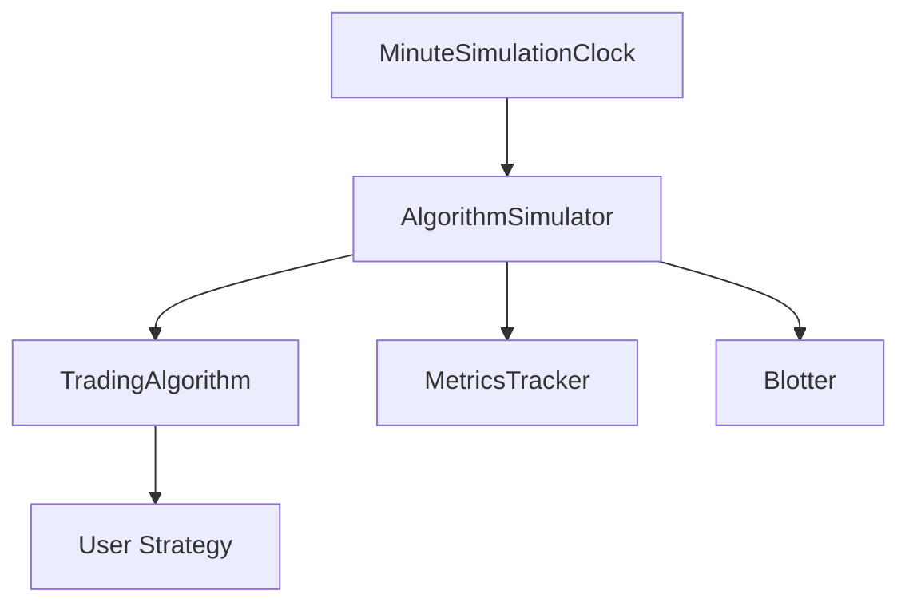

# Story 1.3: Map Existing Architecture and Identify Extension Points

## Status
Draft

## Story
**As a** developer,
**I want** comprehensive documentation of Zipline-Reloaded's architecture and identified modification points,
**so that** I understand where to implement Tier 1 enhancements without breaking existing functionality.

## Acceptance Criteria
1. Architecture diagram created showing major modules (data, execution, performance, pipeline, trading calendar)
2. Module dependency map documented showing relationships between components
3. Extension points identified for Tier 1 features (data pipeline, order types, performance metrics)
4. Data flow documented from ingestion → storage → backtest → performance calculation
5. Test coverage map shows which modules have high coverage (safe to modify) vs. low coverage (risky)
6. Key classes and interfaces documented (TradingAlgorithm, DataPortal, Blotter, PerformanceTracker)
7. Architecture documentation saved to docs/architecture/ for architect reference

## Tasks / Subtasks
- [ ] Analyze Zipline-Reloaded module structure (AC: 1, 2)
  - [ ] Identify 12 major modules from codebase review
  - [ ] Document module purposes and key files using existing analysis
  - [ ] Map inter-module dependencies (imports, function calls)
  - [ ] Create module relationship diagram (use Mermaid or PlantUML)
  - [ ] Document LOC (lines of code) per module for scope understanding

- [ ] Document event-driven architecture (AC: 1, 4)
  - [ ] Map event flow: MinuteSimulationClock → AlgorithmSimulator → TradingAlgorithm → User Strategy
  - [ ] Document event types: BeforeTrading, BarData, AfterTrading
  - [ ] Identify event processing order and temporal isolation mechanisms
  - [ ] Document MetricsTracker integration with event system
  - [ ] Map Blotter order execution flow within event loop

- [ ] Document data layer architecture (AC: 4)
  - [ ] Map DataPortal as unified interface to data sources
  - [ ] Document BcolzDailyBarReader and BcolzMinuteBarReader (to be replaced with Polars/Parquet)
  - [ ] Document SQLiteAdjustmentReader for corporate actions
  - [ ] Document AssetFinder for asset metadata
  - [ ] Trace data flow: Bundle → Reader → DataPortal → TradingAlgorithm → User Strategy
  - [ ] Identify caching mechanisms and performance optimizations

- [ ] Identify extension points for data pipeline (AC: 3)
  - [ ] Document BarReader interface as extension point for Polars/Parquet readers
  - [ ] Identify bundle ingestion hooks for metadata tracking
  - [ ] Map SQLite schema extension points for data provenance tables
  - [ ] Document DataPortal API compatibility requirements
  - [ ] List files to create: rustybt/data/polars/parquet_daily_bars.py, parquet_minute_bars.py, data_portal.py

- [ ] Identify extension points for order types (AC: 3)
  - [ ] Document existing Order class and state machine
  - [ ] Document Blotter order execution logic
  - [ ] Identify where to add Stop-Loss, Stop-Limit, Trailing Stop order types
  - [ ] Map commission and slippage integration points
  - [ ] Document files to extend: rustybt/finance/execution.py, rustybt/finance/blotter.py
  - [ ] Identify order lifecycle hooks for advanced order logic

- [ ] Identify extension points for performance metrics (AC: 3)
  - [ ] Document existing PerformanceTracker and MetricsTracker
  - [ ] Document empyrical-reloaded metrics calculation
  - [ ] Identify where to add Sortino, Calmar, CVaR, VaR, win rate, profit factor
  - [ ] Map integration with DecimalLedger for Decimal-based calculations
  - [ ] Document files to extend: rustybt/finance/metrics/core.py, tracker.py

- [ ] Analyze test coverage and identify safe modification zones (AC: 5)
  - [ ] Run coverage analysis: `pytest tests/ --cov=zipline --cov-report=html --cov-report=term`
  - [ ] Generate coverage report showing per-module coverage percentages
  - [ ] Identify high-coverage modules (≥90%): Safe to extend
  - [ ] Identify low-coverage modules (<70%): Risky, add tests first
  - [ ] Document coverage baseline: 88.26% overall
  - [ ] Create coverage heatmap or table for quick reference

- [ ] Document key classes and interfaces (AC: 6)
  - [ ] TradingAlgorithm: Core algorithm execution engine (algorithm.py, 2,800 LOC)
  - [ ] DataPortal: Unified data access interface (data/data_portal.py)
  - [ ] Blotter: Order execution and transaction management (finance/blotter.py)
  - [ ] PerformanceTracker: Portfolio performance calculation (finance/performance/tracker.py)
  - [ ] AssetFinder: Asset metadata queries (assets/asset_finder.py)
  - [ ] Document public APIs and extension hooks for each class
  - [ ] Identify methods to override vs. extend

- [ ] Create comprehensive architecture documentation (AC: 7)
  - [ ] Create docs/architecture/zipline-architecture-analysis.md
  - [ ] Include all diagrams (module structure, event flow, data flow)
  - [ ] Document extension points with file locations and code snippets
  - [ ] Add test coverage analysis results
  - [ ] Include key class documentation with API summaries
  - [ ] Add recommendations for safe modification patterns
  - [ ] Commit documentation to repository

## Dev Notes

### Existing Project Analysis
[Source: architecture/existing-project-analysis.md]

**Zipline-Reloaded Current State:**
- **Tech Stack:** Python 3.10-3.13, pandas, NumPy, bcolz for OHLCV storage, SQLite/SQLAlchemy for metadata
- **Architecture:** Monolithic Python library with event-driven simulation engine
- **Test Coverage:** 88.26% across 79 test files (4,000+ test cases)
- **LOC:** ~40,000 lines of code across 12 major modules

**Module Structure:**

| Module | Purpose | Key Files |
|--------|---------|-----------|
| **algorithm** | Core algorithm execution engine | `algorithm.py` (2,800 LOC, TradingAlgorithm class) |
| **finance** | Trading mechanics, order management, portfolio accounting | 18 files: blotter, commission, slippage, ledger, controls |
| **data** | Data ingestion, storage, and retrieval | 22 files: bundles, readers (bcolz, HDF5), data_portal |
| **pipeline** | Factor-based screening and computation framework | 21 files: engine, loaders, factors, filters, classifiers |
| **assets** | Asset metadata management and database | 13 files: AssetFinder, AssetDBWriter, continuous_futures |
| **gens** | Event generators and simulation clock | tradesimulation.py, sim_engine.pyx (Cython clock) |
| **utils** | Shared utilities | 35 files: events, validation, calendar utils |
| **lib** | Performance-critical primitives | 16 Cython files for windows, adjustments, ranking |
| **testing** | Testing fixtures and utilities | 10 files: core.py (51KB), fixtures.py (81KB) |

**Event-Driven Architecture:**
```
MinuteSimulationClock (Cython) → AlgorithmSimulator → TradingAlgorithm → User Strategy
                                         ↓
                                   MetricsTracker
                                         ↓
                                   Blotter (order execution)
```

**Data Flow:**
```
DataPortal (unified interface)
├── equity_daily_reader (BcolzDailyBarReader)
├── equity_minute_reader (BcolzMinuteBarReader)
├── adjustment_reader (SQLiteAdjustmentReader)
└── asset_finder (AssetFinder)
```

**Identified Constraints:**
- Numeric Precision: Uses float64 throughout (to be replaced with Decimal)
- Data Storage: bcolz for OHLCV (to be replaced with Polars/Parquet)
- Backtest-Only: No live trading engine (to be added)
- Asset Types: Equity and Future focused, no cryptocurrency support (to be added)
- Synchronous: Single-threaded execution (async to be added for live trading)

### Component Architecture - Extension Points
[Source: architecture/component-architecture.md]

**Data Layer Extension Points:**

**PolarsParquetDailyReader** (replaces BcolzDailyBarReader):
- Location: `rustybt/data/polars/parquet_daily_bars.py`
- Purpose: Read daily OHLCV bars from Parquet with Decimal columns
- Integration: Loaded by PolarsDataPortal, registered with AssetFinder

**PolarsParquetMinuteReader** (replaces BcolzMinuteBarReader):
- Location: `rustybt/data/polars/parquet_minute_bars.py`
- Purpose: Read minute OHLCV bars from Parquet with Decimal columns
- Integration: Used by PolarsDataPortal for minute-resolution backtests

**PolarsDataPortal** (extends DataPortal):
- Location: `rustybt/data/polars/data_portal.py`
- Purpose: Unified data access layer with Polars backend
- Integration: Created by TradingAlgorithm, accessed via data.current(), data.history()

**Finance Layer Extension Points:**

**DecimalLedger** (extends Ledger):
- Location: `rustybt/finance/decimal/ledger.py`
- Purpose: Portfolio accounting with Decimal arithmetic
- Integration: Used by TradingAlgorithm for portfolio state, updated by Blotter

**DecimalPosition** (replaces Position):
- Location: `rustybt/finance/decimal/position.py`
- Purpose: Position tracking with Decimal precision
- Integration: Exposed via context.portfolio.positions

**DecimalTransaction** (replaces Transaction):
- Location: `rustybt/finance/decimal/transaction.py`
- Purpose: Transaction record with Decimal precision
- Integration: Created by Blotter on order fill

**Advanced Order Types Extension:**
- Extend Order class in `rustybt/finance/execution.py`
- Add order types: Stop-Loss, Stop-Limit, Trailing Stop, OCO, Bracket
- Extend Blotter in `rustybt/finance/blotter.py` for execution logic
- Integration: Commission and slippage models apply to all order types

**Performance Metrics Extension:**
- Extend PerformanceTracker: `rustybt/finance/metrics/tracker.py`
- Add metrics: Sortino, Calmar, CVaR, VaR, win rate, profit factor
- Location: `rustybt/finance/metrics/core.py`
- Integration: Integrate with DecimalLedger for Decimal-based calculations

### Project Structure
[Source: architecture/source-tree.md]

**RustyBT Directory Structure (with Extension Points):**
```
rustybt/
├── finance/
│   ├── decimal/                    # NEW: Decimal-based modules
│   │   ├── ledger.py              # DecimalLedger (extends Zipline Ledger)
│   │   ├── position.py            # DecimalPosition
│   │   ├── transaction.py         # DecimalTransaction
│   │   ├── blotter.py             # DecimalBlotter
│   │   └── context.py             # Decimal precision config
│   ├── execution.py               # EXTEND: Advanced order types
│   ├── blotter.py                 # EXTEND: Order execution logic
│   └── metrics/                   # EXTEND: Decimal metrics
│       ├── core.py                # Decimal performance metrics
│       └── tracker.py             # Decimal metrics tracker
│
├── data/
│   ├── polars/                    # NEW: Polars-based data layer
│   │   ├── parquet_daily_bars.py  # PolarsParquetDailyReader
│   │   ├── parquet_minute_bars.py # PolarsParquetMinuteReader
│   │   ├── data_portal.py         # PolarsDataPortal
│   │   └── catalog.py             # DataCatalog with caching
│   ├── bundles/
│   │   ├── core.py                # EXTEND: Add Parquet bundle writer
│   │   └── migration.py           # NEW: bcolz → Parquet migration
│   └── bar_reader.py              # KEEP: Abstract BarReader interface
```

**Preserved Zipline Modules:**
- `algorithm.py`: Extended with live trading hooks
- `assets/`: Extended with cryptocurrency support
- `data/bundles/`: Extended with Parquet support
- `pipeline/`: Extended with Polars compatibility
- `utils/`: Extended with additional utilities

### Testing Strategy
[Source: architecture/testing-strategy.md]

**Test Coverage Analysis:**
- Overall: 88.26% baseline (target: ≥90%)
- Financial modules: Target ≥95% for new code
- Run coverage: `pytest tests/ --cov=zipline --cov-report=html --cov-report=term`

**Coverage Heatmap Creation:**
- Generate HTML coverage report: `pytest tests/ --cov=zipline --cov-report=html`
- Open htmlcov/index.html to view per-file coverage
- Extract per-module coverage percentages
- Create table showing coverage by module for quick reference

**Safe Modification Zones:**
- High coverage (≥90%): Safe to extend, tests will catch regressions
- Medium coverage (70-90%): Moderate risk, add tests for modified areas
- Low coverage (<70%): High risk, add comprehensive tests before modifying

### Coding Standards
[Source: architecture/coding-standards.md]

**Documentation Requirements:**
- Architecture documentation in docs/architecture/
- Use Mermaid or PlantUML for diagrams
- Document integration points between components
- Include code snippets for extension examples

**Diagram Tools:**
- Mermaid: Markdown-based diagrams (renders in GitHub)
- PlantUML: More complex diagrams (requires separate rendering)
- Example Mermaid syntax:


### Architecture Documentation Structure

**docs/architecture/zipline-architecture-analysis.md** should include:

1. **Module Structure**
   - 12 major modules with purposes and LOC
   - Module dependency diagram
   - Key files per module

2. **Event-Driven Architecture**
   - Event flow diagram
   - Event types and processing order
   - Temporal isolation mechanisms

3. **Data Layer Architecture**
   - DataPortal interface
   - Reader implementations (Bcolz, HDF5)
   - Data flow diagram

4. **Extension Points for Tier 1 Features**
   - Data pipeline: BarReader interface, bundle ingestion hooks
   - Order types: Order class, Blotter execution logic
   - Performance metrics: PerformanceTracker, MetricsTracker

5. **Test Coverage Analysis**
   - Overall coverage: 88.26%
   - Per-module coverage table
   - Safe vs. risky modification zones

6. **Key Classes Documentation**
   - TradingAlgorithm: Core algorithm execution
   - DataPortal: Unified data access
   - Blotter: Order execution
   - PerformanceTracker: Performance calculation
   - AssetFinder: Asset metadata

7. **Recommendations**
   - Safe modification patterns
   - Testing requirements for extensions
   - Integration best practices

### Testing

**Test File Location:**
- No test files for this story (documentation only)
- Coverage analysis uses existing test suite

**Test Standards:**
- Run coverage analysis: `pytest tests/ --cov=zipline --cov-report=html --cov-report=term`
- Generate coverage heatmap for module-level analysis
- Document coverage baseline for future comparison

**Testing Frameworks:**
- pytest for coverage analysis
- Coverage.py for coverage reporting

**Manual Verification:**
1. Review generated architecture documentation
2. Verify all diagrams render correctly
3. Check extension points are accurately documented
4. Confirm test coverage analysis is complete
5. Validate key class documentation is comprehensive

## Change Log
| Date | Version | Description | Author |
|------|---------|-------------|--------|
| 2025-09-30 | 1.0 | Initial story creation | Bob (Scrum Master) |

## Dev Agent Record

### Agent Model Used
_To be populated by dev agent_

### Debug Log References
_To be populated by dev agent_

### Completion Notes List
_To be populated by dev agent_

### File List
_To be populated by dev agent_

## QA Results
_To be populated by QA agent_
